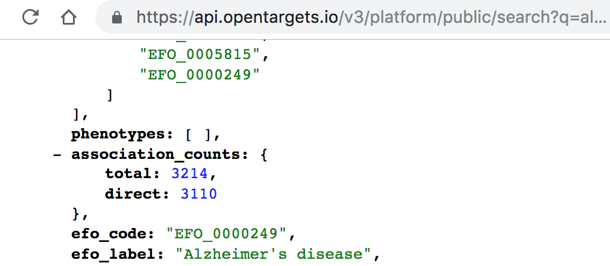

# What is an indirect association?

Indirect associations between targets and diseases are computed based on indirect evidence, rather than observed \(direct\) evidence. 

If you search for a **target** using the web interface of the Open Targets Platform, you will get associations based on direct evidence only. However, ****if you search for a **disease**, you will get both direct and indirect associations, since we propagate evidence from lower sections of a disease ontology, this evidence is used as indirect evidence for the associations.

When retrieving our data via the [Open Targets REST API](https://docs.targetvalidation.org/programmatic-access/rest-api), you will get two types of association counts:



The difference between`total`and`direct`is the number of associations based on indirect evidence. 

To get direct associations only, you should include the parameter `direct = true` when using our REST-API endpoints, such as the `association/filter` below:

```text
https://platform-api.opentargets.io/v3/platform/public/association/filter?disease=EFO_0000400&direct=true
```

We propagate the indirect evidence from a child term up to its parent term in the disease ontology for all diseases in our Platform. By computing new target-disease associations when there is no direct \(known and observed\) evidence for them, we allow:

* finding common targets across groups of related diseases \(e.g. ulcerative colitis, Crohn's disease and inflammatory bowel disease\)
* making connections between rare and common diseases \(e.g. autosomal recessive early-onset inflammatory bowel disease and inflammatory bowel disease\)
* grouping evidence for all diseases within a therapeutic area
* identifying unforeseen associations by serendipity

Read our [Direct versus indirect evidence: should you care?](http://blog.opentargets.org/direct-versus-indirect-evidence-should-you-care/) blog post for more details and [email us](mailto:support@targetvalidation.org) if you have further questions.


