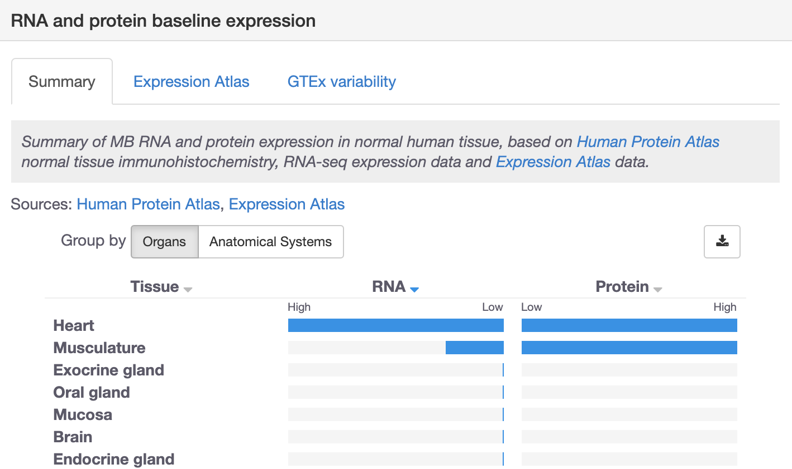

# Baseline expression

Baseline RNA and protein expression data helps us to ascertain whether the target is expressed in all tissues \(e.g. housekeeping genes\) or only in one or few tissues \(cells or organs\). This information is relevant at several stages of drug target identification and prioritisation, including during target safety and toxicological assessments. 

We combine baseline expression information from three sources:

* [Expression Atlas](https://www.ebi.ac.uk/gxa/home): ****RNA expression meta-analysis from RNA- sequencing experiments
* [Human Protein Atlas](https://www.proteinatlas.org/):  immunohistochemistry-based proteomics data for normal tissues
* [Genotype-Tissue Expression \(GTEx\) Program](https://commonfund.nih.gov/GTEx/): ****RNA baseline expression variation data per tissue

In this page, you will find details on how the data for **RNA** expression shown in the Summary view in the target profile page:

### RNA expression meta-analysis

Expression Atlas has carried out a meta-analysis of over 18,000 samples from 50 different tissues and more than 30 cell types from the following experiments: 

* RNA-seq of 53 human tissue samples from GTEx \([E-MTAB-5214](https://www.ebi.ac.uk/gxa/experiments/E-MTAB-5214/Results)\)
* RNA-seq of 16 human tissues from the Illumina Body Map project \([E-MTAB-513](https://www.ebi.ac.uk/gxa/experiments/E-MTAB-513/Results)\)
* RNA-seq of 13 human tissue from the ENCODE project \(Snyder Lab\) \([E-MTAB-4344](https://www.ebi.ac.uk/gxa/experiments/E-MTAB-4344/Results)\)
* RNA-seq of 6 human tissues from Kaessmann Lab \([E-MTAB-3716](https://www.ebi.ac.uk/gxa/experiments/E-MTAB-3716/Results)\)
* mRNA-seq of 32 human tissues from Human Protein Atlas \([E-MTAB-2836](https://www.ebi.ac.uk/gxa/experiments/E-MTAB-2836/Results)\)
* mRNA-seq of rare types of cells of different haemopoetic lineages from healthy individuals in the BLUEPRINT project \([E-MTAB-3819](https://www.ebi.ac.uk/gxa/experiments/E-MTAB-3819/Results)\)
* RNA-seq of common types of cells of different haemopoetic lineages from healthy individuals in the BLUEPRINT project \([E-MTAB-3827](https://www.ebi.ac.uk/gxa/experiments/E-MTAB-3827/Results)\) 
* mRNA-seq of plasma cells of tonsil from healthy individuals from the BLUEPRINT project \([E-MTAB-4754](https://www.ebi.ac.uk/gxa/experiments/E-MTAB-4754/Results)\)

The tissue- and cell-based samples in these experiments are processed separately to avoid batch effects during normalisation. The samples of each group are then processed together to generate an expression table of normalised Transcripts Per Million \(TPMs\) units for every gene in each tissue or cell type according to the following steps:

* Technical replicates are aggregated
* Genes that are expressed below a pre-defined threshold \(i.e. minimum of 10 raw reads in at least 15 samples\) are filtered out
* Samples are then normalised in a two-step process according to [Risso et al. 2014](https://europepmc.org/article/MED/25150836) using the RUV \(Remove Unwanted Variation\) method:
  * The Coefficient of Variation \(CV\) was estimated for each gene across all the samples and used to select the least variable genes.
  * The least variable 1,000 genes were used as negative controls; that is, assumed not to be differentially expressed, to train RUVg to remove unwanted variation
* Tissues are mapped to anatomical ontology terms using the [Uber-anatomy ontology](https://www.ebi.ac.uk/ols/ontologies/uberon). Tissues that can't be mapped are then discarded
* Samples from the same tissue across different experiments are averaged by median and then merged in the final matrix
* Expression tables of the tissue- and cell-based experiments are combined

We analyse this expression file further to compute two values for each gene:

* **Binned value of expression:** The normalised expression values are divided into 10 bins of the same width. Note that this is not the same as the deciles, which all contain the same number of items in them
* **Tissue specificity:** Z-scores are calculated for each gene and each tissue and then they are binned based on quantiles of a perfect normal distribution. This allows to extract the tissues for which a gene is specific, defined as the expression value being above the 75th z-score percentile - in practice, anything in bin 2 or above \(more information in the [FAQ section](https://docs.targetvalidation.org/faq/tissue-specificity)\)

