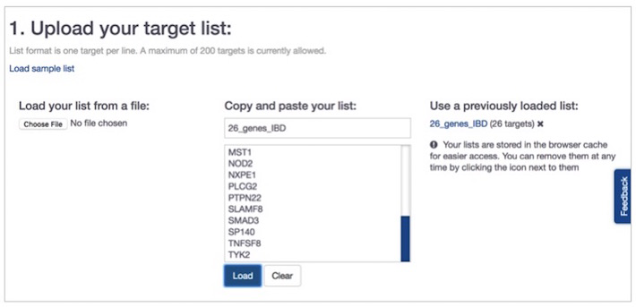
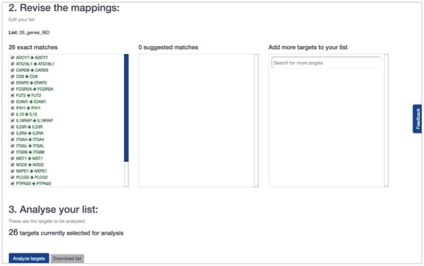

# Batch search


**Important update - May 2021:**

With the launch of the [next-generation Platform](https://platform.opentargets.org/) in April 2021, we have deprecated our batch search functionality and are working on a replacement approach. For more information, please see [our Community post on batch search](https://community.opentargets.org/t/what-happened-to-the-batch-search-functionality/72/3). ****


Go to the [homepage](https://www.targetvalidation.org/) and click on the link [batch search](https://www.targetvalidation.org/batch-search), which is below the search box.

Alternatively, if you are on another page than the homepage, look for the search bar in the upper right hand corner and click on the `list` icon as shown below:

Once you are on the [batch search main page](https://www.targetvalidation.org/batch-search), upload your target list \(one target per line as a`.txt`or`.csv`\), or copy and paste it into the box. If you paste your list, you need to give it a name, so that you can get back to it later. Hit the`Load`button:

Scroll down the page to revise the mappings. If your targets cannot be mapped as exact matches, you will see a list of suggested matches. Click on the suggested target symbol to view a list of suggested alternatives, and select the symbol you like. You can upload your list of targets as HGNC gene symbols, Ensembl Gene IDs, UniProt IDs or protein names, and gene synonyms. Hit`Analyse targets`button.

## What results will I get from the batch search tool? 

You will get a summary page with the results divided into six sections:

### 1\) Diseases associated 

You will get the associated diseases, which are classified either by Therapeutic areas, the default view \(e.g. Immune system disease\), or by Data types \(e.g Genetic associations\).

We rank the associated diseases according to the probability of finding a disease associated with **your** set of targets. We use the [hypergeometric distribution](https://en.wikipedia.org/wiki/Hypergeometric_distribution) as an attempt to order the most relevant diseases associated with your list of targets. Look out for the relevance _p_ value in the results table. The lower this value, the higher is the probability your list of targets are specific to the disease.

### 2\) Pathways 

You will get the pathways associated with your targets by calling the Reactome [Pathway Analysis Service](https://reactome.org/AnalysisService/) followed by the hypergeometric distribution to rank relevant pathways \(as outlined above\).

Click on the pathway names, e.g. [NOD1/2 Signaling Pathway](https://www.targetvalidation.org/summary?pathway=R-HSA-168638&pathway-target=NOD2&pathway-target=CARD9) to get to its pathway diagram from Reactome. 

### 3\) Gene Ontology 

You will get the gene ontology \(GO\) terms enriched in your list of targets, ranked by the relevance _p_ value \(as outlined above\). The GO terms are retrieved from[ Gprofiler](https://biit.cs.ut.ee/gprofiler/gost).

### 4\) Tractability information 

You will get a summary of the [target tractability](https://docs.targetvalidation.org/getting-started/target-tractability) data available for your list of targets, whether they can be targeted by a small molecule or antibody. Each of these two drug modalities is further divided into three groups of confidence: 

* clinical precedence, discovery precedence and predicted tractable: antibody
* clinical precedence, predicted tractable \(high confidence\), predicted tractable \(mid-low confidence\): small molecule

### 5\) Drugs 

You will get the drugs from ChEMBL matching your list of targets, the target name, the most advanced stage in clinical trials, and the molecule type of the drug compound.

Click on the drug name, e.g. [NATALIZUMAB](https://www.targetvalidation.org/summary?drug=CHEMBL1201607) to get general properties of that drug and links to DailyMed and ChEMBL.

### 6\) Interactions between targets 

You will get a summary of protein interactions based on the data from [OmniPath DB](http://omnipathdb.org/) for any two targets from your list.

Note that the current limit on the number of targets you can upload \(or paste in\) is 200.


For a demo of the batch search, check our tutorial video [How to search for many drug targets at once with Open Targets](https://www.youtube.com/watch?v=CPkAxnVrt_s).




