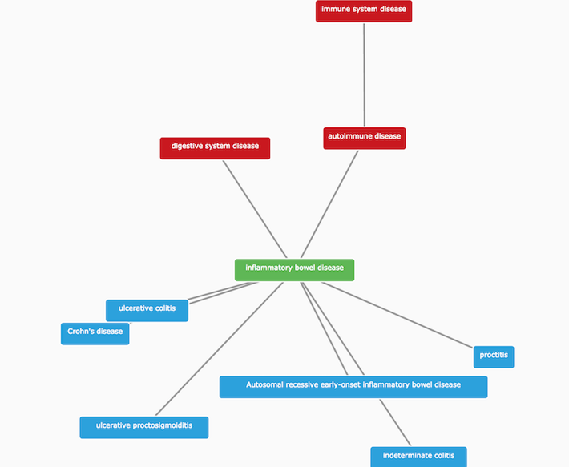

# Evidence

The evidence for target-disease associations comes in different shapes and sizes. Some of them are from experiments using nucleotide sequencing. Others are drugs from clinical trials. Some are identified through sentences mined from research articles. Evidence can be manually curated or they can come from automated annotation.

To describe this variety, we use ontology terms from the [Evidence and Conclusion Ontology](http://evidenceontology.org/Welcome.html), or ECO. Our data providers send the evidence to us in a JSON file, containing the following:

* the evidence itself, e.g. a disease linked to a SNP by genome wide association.
* the source of the evidence, e.g. GWAS catalog.
* the ECO code of the evidence, e.g. [ECO\_0000006](http://bioportal.bioontology.org/ontologies/ECO/?p=classes&conceptid=http%3A%2F%2Fpurl.obolibrary.org%2Fobo%2FECO_0000006).
* the target ID the evidence maps to, e.g. ENSG00000110324 \([IL10RA](http://www.targetvalidation.org/target/ENSG00000110324)\).
* the disease ID the evidence matches to, e.g. EFO\_0003767 \([inflammatory bowel disease](http://www.targetvalidation.org/disease/EFO_0003767)\).

We then validate and integrate the data in the JSON files, so that we can use the 5.1 million of evidence items to identify our target-disease associations, over 2.6 million of them.

The ECO is not the only ontology that comes in handy in our Platform. We also use the [Experimental Factor Ontology](http://www.targetvalidation.org/faq#efo) or EFO, for the hierarchical classification of diseases into parent and child terms.

For instance, IBD is a child of autoimmune disease, and the parent term of other related diseases, such as [ulcerative colitis](http://www.targetvalidation.org/disease/EFO_0000729) and [Crohn's disease](http://www.targetvalidation.org/disease/EFO_0000384).

We use these parent-child relationships to propagate direct evidence from IBD up to higher levels in its ontology tree, and to provide additional integration. We refer to this type of evidence as indirect. We use indirect evidence to expand the number of associations that we would not have identified otherwise.

What does this expansion based on indirect evidence enable us to do?

* It allows finding common targets across groups of related diseases \(e.g. ulcerative colitis, Crohn's disease and inflammatory bowel disease\)
* It makes connections between rare and common diseases \(e.g. autosomal recessive early-onset inflammatory bowel disease and inflammatory bowel disease\)
* It groups evidence for all diseases within a therapeutic area
* It allows the identification of unforeseen associations by serendipity

Moreover, the different evidence types coming from our [data sources](https://www.targetvalidation.org/data_sources) often are associated with diseases at different levels of their ontology. For instance, the electronic description of diseases from drugs in clinical trials can be rather general, whereas rare genetic diseases are defined in much greater detail.

