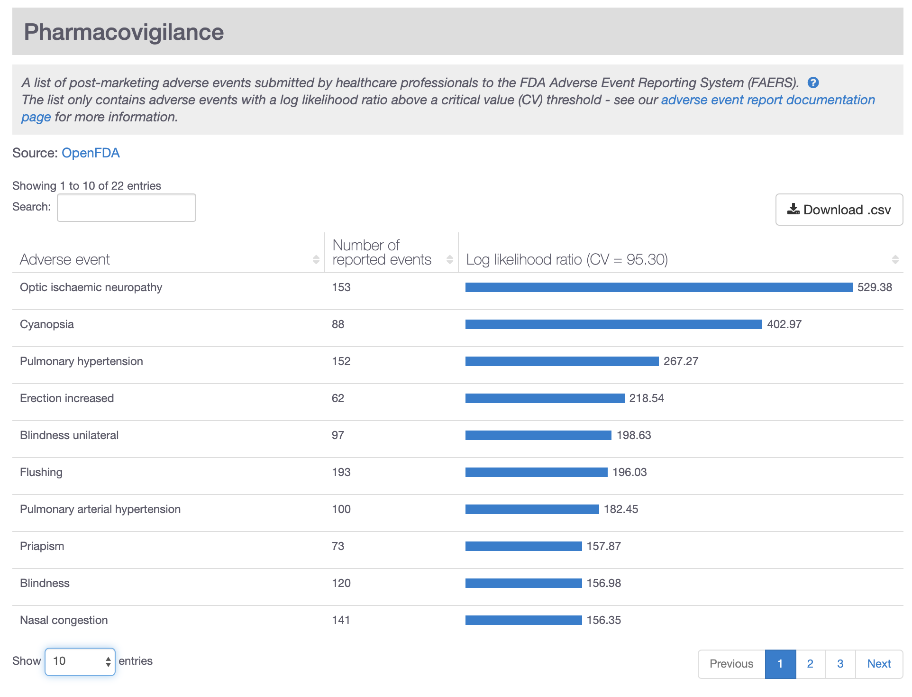

# Pharmacovigilance

New treatments are tested in clinical trials but some of the side effects are only identified when prescribed to larger cohorts of patients, with one or multiple conditions, for a sustained period of time or in combination with other treatments. For this reason, regulatory agencies \(e.g. FDA\) provide pharmacovigilance programs to monitor and survey Adverse Drug Reactions \(ADRs\). For example, the [FDA Adverse Event Reporting System \(FAERS\)](https://open.fda.gov/data/faers/) currently contains 10.4 million public reports characterising any undesirable experience associated with the use of a medicinal product in a patient.

Open Targets aims to provide a list of significant ADRs linked to the drugs available in the Open Targets Platform. While recurrence of a given adverse event is relevant, it's the specificity of the event to the drug what might flag concerns. In order to get a list of significant drug-ADRs associations, we have implemented an analysis similar to the one described by [Maciejewski et al. \(2017\)](https://europepmc.org/abstract/MED/28786378).

First we apply a set of filters to the reports as described below:

* Only reports submitted by health professionals \(_primarysource.qualification in \(1,2,3\)_\).
* Exclude reports that resulted in death \(no entries with _seriousnessdeath=1_\).
* Only drugs that were considered by the reporter to be the cause of the event _\(drugcharacterization=1\)_
* Remove [blacklisted](https://github.com/opentargets/platform-etl-openfda-faers/blob/master/blacklisted_events.txt) events curated manually to exclude uninformative events

Next, we sought to map the drugs in the FAERS reports to the drugs in the Open Targets Platform \(ChEMBL IDs\). Any of the above listed fields were used when exact matches were available:

| FAERS drugs | Open Targets Platform drugs |
| :--- | :--- |
| `drug.medicinalproduct` | `drug.medicinalproduct` |
| `drug.openfda.generic_name` | `synonyms` |
| `drug.openfda.brand_name` | `pref_name` |
| `drug.openfda.substance_name` | `trade_names` |

The significant drug-ADR pairs were then evaluated using the Likelihood Ratio Test \(LRT\) as previously described by [Huang et al. \(2011\)](https://europepmc.org/abstract/MED/23331230). The significance of a given drug-ADR is implicitly corrected by how often a drug is found in a report and how often an event is reported across drugs. This way, we prevent the drug-ADR associations to be biased by overrepresented ADRs \(e.g. headache, nausea\) or drugs \(e.g. paracetamol, ibuprofen\). In order to assess significance, an LRT critical value for every drug is calculated using an empirical Monte Carlo simulation, similar to the one implemented by [openFDA](https://openfda.shinyapps.io/LRTest/_w_c5c2d04d/lrtmethod.pdf).


The code to reproduce the Open Targets Platform approach to ADRs is available on [GitHub](https://github.com/opentargets/platform-etl-openfda-faers).


Due to the nature of the surveillance reports, it's relatively common for the indication for which a drug was prescribed to appear in the list of significant ADRs. From the current analysis, it's not trivial to distinguish whether it's a problem with the dosage the drug was prescribed or an excessive phenotypic characterisation of the patient in the report.

It's also recurrent to find events related to drug misuse in all drugs frequently prescribed over the counter. While the exclusion of reports associated with death alleviates the problem, still a significant number of drug abuses can be found linked to very common drugs.

If you want to discuss any of these shortcomings, please contact the [support](mailto:support@targetvalidation.org) team.

