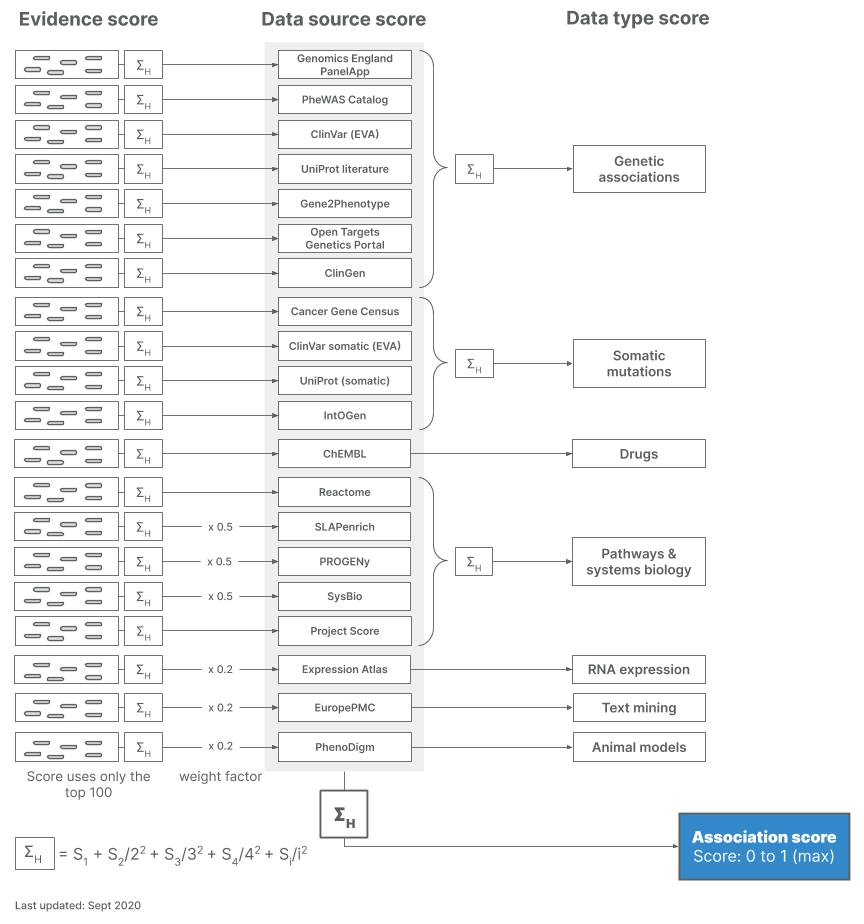

# Association score

The [Open Targets Platform](https://www.targetvalidation.org/) allows prioritisation of drug targets based on the strength of their association with a disease.

We allow for the prioritisation of targets by scoring target-disease associations based on evidence from 19 [data sources](https://docs.targetvalidation.org/data-sources/). Similar data sources \(e.g. [Open Targets Genetics Portal](https://genetics.opentargets.org/) and PheWAS\) are grouped together into data types \(e.g. Genetic associations\). The score for the associations ranges from 0 to 1; the stronger the evidence for an association, the stronger the association score \(closer to 1\). A score of 0 corresponds to no evidence supporting an association. In the Open Targets Platform, we represent the different scores with varying shades of blue: the darker the blue, the stronger the association.

What are the factors that affect the confidence we have in the evidence used for our associations? We assess key factors such as frequency, severity and significance of the evidence to provide association scores to help you answer these questions:

* Which targets have the most evidence for being associated with a disease?
* What is the relative weight of the evidence for different targets associated with a disease?

Our scoring framework is a four-tier process: we first score the individual evidence, then we aggregate the evidence scores into data sources scores, followed by the aggregation of data source scores to give rise to the data types scores. Our overall association score is the result of the aggregation of all data source scores together.


`Pathways & systems biology` is the new name for what we used to call`Affected pathways`in the user interface of Open Targets Platform.


At each aggregation step, denoted by the `sum` symbol above, we apply the [harmonic progression](https://en.wikipedia.org/wiki/Harmonic_progression_%28mathematics%29) using the following formula as follows:

## Computing the Association Score 

We start by generating a score for each evidence from different data sources \(e.g. European Variation Archive\) within a data type \(e.g. Genetic associations\). We define the evidence score as:

`s = F * S * C`

where

s = score

F = frequency, the relative occurrence of a target-disease evidence

S = severity, the magnitude or strength of the effect described by the evidence

C = confidence, overall confidence for the observation that generates the target-disease evidence

The evidence score summarises the strength of the evidence and depends on factors that affect its relative strength. These factors are specific to the different data sources in the Platform.

#### Genetic associations

<table>
  <thead>
    <tr>
      <th style="text-align:left">Data type</th>
      <th style="text-align:left">Data source</th>
      <th style="text-align:left">Description of scoring</th>
    </tr>
  </thead>
  <tbody>
    <tr>
      <td style="text-align:left">Genetic associations</td>
      <td style="text-align:left">ClinVar (EVA)</td>
      <td style="text-align:left">Numeric score based on clinical significance assessment from ClinVar:
        &quot;association not found&quot; = 0.0, &quot;benign&quot; = 0.0, &quot;not
        provided&quot; = 0.0, &quot;likely benign&quot; = 0.0, &quot;conflicting
        interpretations of pathogenicity&quot; = 0.3, &quot;other&quot; = 0.3,
        &quot;uncertain significance&quot; = 0.3, &quot;risk factor&quot; = 0.5,
        &quot;affects&quot; = 0.5, &quot;likely pathogenic&quot; = 1, &quot;association&quot;
        = 1, &quot;drug response&quot; = 1, &quot;protective&quot; = 1, &quot;pathogenic&quot;
        = 1</td>
    </tr>
    <tr>
      <td style="text-align:left">Genetic associations</td>
      <td style="text-align:left">PheWAS Catalog</td>
      <td style="text-align:left">
        
Product of:

        <ul>
          <li>Normalised p-value</li>
          <li>Normalised sample size</li>
        </ul>
      </td>
    </tr>
    <tr>
      <td style="text-align:left">Genetic associations</td>
      <td style="text-align:left">Gene2Phenotype</td>
      <td style="text-align:left">Numeric score based on confidence level that curators assign to the gene-disease
        evidence: &quot;Confirmed&quot; = 1, &quot;Probable&quot; = 0.5, &quot;Possible&quot;
        = 0.25, &quot;Both RD and IF&quot; = 1, &quot;Child IF&quot; = 1</td>
    </tr>
    <tr>
      <td style="text-align:left">Genetic associations</td>
      <td style="text-align:left">Genomics England PanelApp</td>
      <td style="text-align:left">Gene-disease associations are curated and crowdsourced by experts and
        all are given the highest score of 1</td>
    </tr>
    <tr>
      <td style="text-align:left">Genetic associations</td>
      <td style="text-align:left">Open Targets Genetics Portal</td>
      <td style="text-align:left"><a href="https://docs.targetvalidation.org/data-sources/genetic-associations#open-targets-genetics-portal">Locus 2 gene (L2G) score</a>,
        filtered to use scores above 0.05</td>
    </tr>
    <tr>
      <td style="text-align:left">Genetic associations</td>
      <td style="text-align:left">UniProt literature</td>
      <td style="text-align:left">Curator inference score based on how strong the evidence for the gene&apos;s
        involvement in the disease is. 1 if the evidence is strong and 0.5 if evidence
        deemed not to be strong by the curator</td>
    </tr>
    <tr>
      <td style="text-align:left">Genetic associations</td>
      <td style="text-align:left">ClinGen</td>
      <td style="text-align:left">Gene-disease pairs are curated by experts using a standardised approach
        and controlled vocabulary that corresponds to specific evidence scores:
        &quot;Definitive&quot; = 1, &quot;Strong&quot; = 1, &quot;Moderate&quot;
        = 0.5, &quot;Limited&quot; = 0.01, &quot;Disputed&quot; = 0.01, &quot;No
        Reported Evidence&quot; = 0.01, &quot;Conflicting Evidence&quot; = 0.01</td>
    </tr>
  </tbody>
</table>

#### Somatic mutations

<table>
  <thead>
    <tr>
      <th style="text-align:left">Data type</th>
      <th style="text-align:left">Data source</th>
      <th style="text-align:left">Description of scoring</th>
    </tr>
  </thead>
  <tbody>
    <tr>
      <td style="text-align:left">Somatic mutations</td>
      <td style="text-align:left">Cancer Gene Census</td>
      <td style="text-align:left">
        
Score based on tier of gene and frequency of mutations:

        <ul>
          <li>0.5 for Tier 2 genes</li>
          <li>0.25, 0.5, 0.75 or 1 for Tier 1 genes: base score of 0.5 modified as follows:
            <ul>
              <li>-0.25 if only 1 mutated sample</li>
              <li>+0.25 if gene mutated more frequently in particular disease compared to
                all other diseases</li>
              <li>+0.25 if mutations in a gene occur more frequently than in other genes
                of similar length in the same disease</li>
            </ul>
          </li>
        </ul>
      </td>
    </tr>
    <tr>
      <td style="text-align:left">Somatic mutations</td>
      <td style="text-align:left">ClinVar somatic (EVA)</td>
      <td style="text-align:left">Confidence of evidence-disease association - currently fixed value of
        1</td>
    </tr>
    <tr>
      <td style="text-align:left">Somatic mutations</td>
      <td style="text-align:left">IntOGen</td>
      <td style="text-align:left">Normalised <a href="https://intogen.readthedocs.io/en/latest/drivers_combination.html">combined q-value of driver identification methods</a>
      </td>
    </tr>
  </tbody>
</table>

#### Drugs

<table>
  <thead>
    <tr>
      <th style="text-align:left">Data type</th>
      <th style="text-align:left">Data source</th>
      <th style="text-align:left">Description of scoring</th>
    </tr>
  </thead>
  <tbody>
    <tr>
      <td style="text-align:left">Drugs</td>
      <td style="text-align:left">ChEMBL</td>
      <td style="text-align:left">
        
Porduct of:

        <ul>
          <li>Clinical trials phase binned score: Phase 0 = 0.09, Phase I = 0.1, Phase
            II = 0.2, Phase III = 0.7, Phase IV = 1.0</li>
          <li>Confidence of the gene being the target of the drug - currently fixed
            value of 1</li>
        </ul>
      </td>
    </tr>
  </tbody>
</table>

#### Pathways and systems biology \(previously known as Affected pathways\)

<table>
  <thead>
    <tr>
      <th style="text-align:left">Data type</th>
      <th style="text-align:left">Data source</th>
      <th style="text-align:left">Description of scoring</th>
    </tr>
  </thead>
  <tbody>
    <tr>
      <td style="text-align:left">Pathways and systems biology</td>
      <td style="text-align:left">Reactome</td>
      <td style="text-align:left">Fixed value of 1 since association is inferred by a curator</td>
    </tr>
    <tr>
      <td style="text-align:left">Pathways and systems biology</td>
      <td style="text-align:left">Sysbio</td>
      <td style="text-align:left">
        
Scoring depends on whether the original data contains or not a score:

        <ul>
          <li>P-values and rank-based scores are normalised to the values in the 0.5-1
            range</li>
          <li>If there is no score a fixed value of 0.75 is used</li>
        </ul>
      </td>
    </tr>
    <tr>
      <td style="text-align:left">Pathways and systems biology</td>
      <td style="text-align:left">SLAPenrich</td>
      <td style="text-align:left">Scored according to <a href="https://europepmc.org/article/PMC/5928049">Iorio F et al 2018</a>,
        followed by quantifying, in large cohorts of cancer patients, the divergence
        of the total number of samples with genomic alterations in pathway from
        its expectation, accounting for mutational burdens and total exonic block
        lengths of genes in that pathway</td>
    </tr>
    <tr>
      <td style="text-align:left">Pathways and systems biology</td>
      <td style="text-align:left">PROGENy</td>
      <td style="text-align:left">Scored per sample and pathway following a modifications of the original
        implementation described by <a href="https://europepmc.org/abstract/MED/29295995">Schubert et al. 2016</a>.
        Further details are available <a href="https://github.com/saezlab/progeny">here</a>.</td>
    </tr>
    <tr>
      <td style="text-align:left">Pathways and systems biology</td>
      <td style="text-align:left">Project Score (CRISPR)</td>
      <td style="text-align:left">Score based on the priority score divided by 100. The prioritiy score
        is described by <a href="https://europepmc.org/abstract/MED/30971826">Behan et al. 2019</a>,
        which varies from 0 to 100 (any value above 40 is significant) and is available
        in <a href="https://www.nature.com/articles/s41586-019-1103-9#Sec44">supplementary table 6 in the publication</a>
      </td>
    </tr>
  </tbody>
</table>

#### RNA expression

<table>
  <thead>
    <tr>
      <th style="text-align:left">Data type</th>
      <th style="text-align:left">Data source</th>
      <th style="text-align:left">Description of scoring</th>
    </tr>
  </thead>
  <tbody>
    <tr>
      <td style="text-align:left">RNA expression</td>
      <td style="text-align:left">Expression Atlas</td>
      <td style="text-align:left">
        
Product of:

        <ul>
          <li>Normalised p-value</li>
          <li>Normalised expression fold change</li>
          <li>Normalised percentile rank</li>
        </ul>
      </td>
    </tr>
  </tbody>
</table>

#### Text mining

| Data type | Data source | Description of scoring |
| :--- | :--- | :--- |
| Text mining | EuropePMC | Score based on weighted document sections, sentence locations, and title for full text articles and abstracts as described in [Kafkas et al., 2016](https://europepmc.org/abstract/MED/28587637) |

#### Animal models

| Data type | Data source | Description of scoring |
| :--- | :--- | :--- |
| Animal models | PhenoDigm | Similarity score between a mouse model and a human disease described by [Smedley et al 2013](https://europepmc.org/abstract/MED/23660285) |

Once we have the scores for each evidence, we calculate an overall score for a data source \(e.g. Genomics England PanelApp\) followed by a score for a data type \(e.g. Genetic associations\). In this step, we take into account that although multiple occurrences of evidence can suggest a strong association, the inclusion of further new evidence should not have a great impact on the overall score. For this reason, we calculate the sum of the harmonic progression of each score and adjust the contribution of each of them using a heuristic weight.

Throughout this process, the value of the score is always capped at 1, the highest association score.

To learn more about our approach to scoring, please see our latest publication, [Open Targets Platform: supporting systematic drug–target identification and prioritisation](https://doi.org/10.1093/nar/gkaa1027).


Evidence from`PROGENy, SLAPenrich and Sysbio` is down weighted by a factor of 2, whereas evidence from`Expression Atlas, PhenoDigm and Europe PMC` is down weighted by a factor of 5.

Also, since our [18.12 release](https://docs.targetvalidation.org/release-notes#release-3-10-2018-12-14), we no longer apply a sigmoid scaling to the scores for target-disease associations, which was based on the number of hits per expression study \(for RNA Expression\) and on the number of targets per publication \(for Text mining\). 


