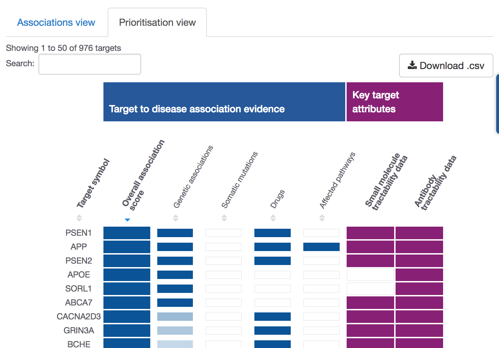
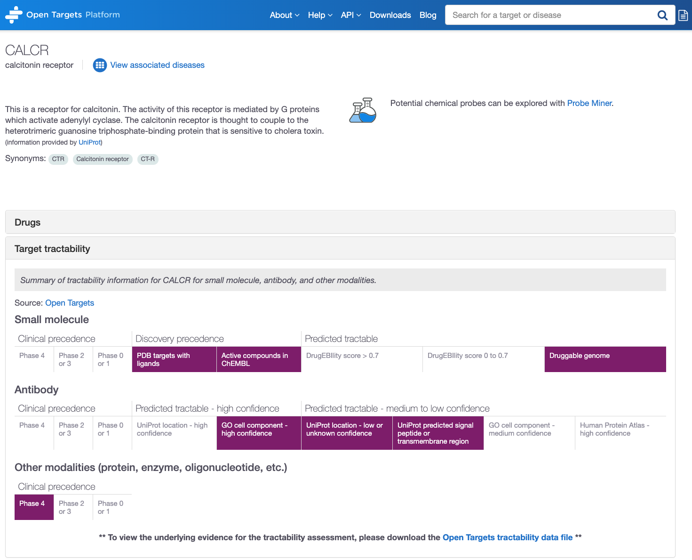

# Target tractability

The assessment of target tractability \(also known as druggability\) allows you to exploit target details, such as whether there is a binding site in the protein that can be used for small molecule binding, an accessible epitope for antibody based therapy, or a compound in clinical trials with a modality other than small molecule or antibody. This can assist in target prioritisation, drug target inclusion in discovery pipelines and selection of therapeutic modalities that are most likely to succeed.

Another advantage of tractability data is that it allows you to exploit targets for which there are no ligands or experimental structure, or those targets which are outside a "druggable" target family, but which have strong genetic associations.


Check our FAQs for our definition of [target tractability](https://docs.targetvalidation.org/faq/what-is-target-tractability). Note that druggability, ligandability and target quality can sometimes be used interchangeably as some researchers may give similar definitions to these terms. 


Our target tractability is based on a modified version of [Approaches to target tractability assessment – a practical perspective](https://pubs.rsc.org/en/content/articlelanding/2018/md/c7md00633k#!divAbstract). We have been working with our partners to evaluate and validate existing tractability methods. Our colleagues in the ChEMBL team have developed a [tractability pipeline](https://github.com/melschneider/tractability_pipeline_v2) that performs _in silico_ tractability assessments with small molecule, antibody, and other clinical modality workflows. 

Each of these workflows takes our [gene list](https://www.targetvalidation.org/downloads/data) and makes a tractability assessment using hierarchical qualitative buckets based on data from UniProt, HPA, PDBe, DrugEBIlity, ChEMBL, Pfam, InterPro, Complex Portal, DrugBank, Gene Ontology, and BioModels. 

| Buckets | Small molecule                                             | Antibody | Other modalities \(e.g. enzyme, protein, oligonucleotide, etc.\) |
| :--- | :--- | :--- | :--- |
| 1 | Targets with drugs in phase IV | Targets with drugs in phase IV | Targets with drugs in phase IV |
| 2 | Targets with drugs in phase II or phase III | Targets with drugs in phase II or phase III | Targets with drugs in phase II or phase III |
| 3 | Targets with drugs in phase 0 or phase I | Targets with drugs in phase 0 or phase I | Targets with drugs in phase 0 or phase I |
| 4 | Targets with crystal structures with ligands \(excluding: buffer compounds, solvents, crystallization agents/additives and sugars\)  | Targets with UniProt 'Subcellular location' terms indicative for plasma membrane, extracellular region/matrix, or secretion - high confidence |  |
| 5 | Targets with high quality ligands \(PFI ≤7, structural\_alerts ≤2, pchembl\_value ≥5.5 or equivalent activity measure\) | Targets with GO 'Cellular component' terms indicative for plasma membrane, extracellular region/matrix, or secretion - high confidence |  |
| 6 | Targets with a drugEBIlity score equal or greater than 0.7 | Targets with UniProt 'Subcellular location' terms indicative for plasma membrane, extracellular region/matrix, or secretion - medium confidence |  |
| 7 | Targets with drugEBIlity between 0 and 0.7 | Targets with predicted Signal Peptide or Trans-membrane regions, and not destined to organelles |  |
| 8 | Targets considered druggable by [Finan et al. 2017](https://europepmc.org/article/MED/28356508) | Targets with GO 'Cellular component' terms indicative for plasma membrane, extracellular region/matrix, or secretion - medium confidence |  |
| 9 | N.A. | Targets with main location “Plasma membrane” - high confidence |  |

When you search for a disease, you will find the list of target associated with that disease. By default, the table shows the `Associations view`. We now provide an additional view called `Prioritisation view`, where you will see some key target attributes, such as tractability information, in addition to target to disease association evidence. This is what you will find when searching for the [targets associated with Alzheimer's](https://www.targetvalidation.org/disease/EFO_0000249/associations) and click on the "Prioritisation view" tab:



For any of those targets, we will highlight whether small molecule or antibody have been predicted to tract the target. Click on any of the cells coloured in light purple to get redirected to the target profile page. 

In the profile page of a target, such as [CALCR](https://www.targetvalidation.org/target/ENSG00000004948), you will see the following:



In `Target tractability`, you will see three different categories \(Clinical precedence, Discovery precedence and Predicted tractable\), further subdivided into the buckets listed above. The buckets vary depending on the drug modality and are listed below:

* A\) small molecule: 
  * clinical precedence: buckets 1, 2, and 3
  * discovery precedence: buckets 4 and 5
  * predictable tractable: buckets 6, 7, and 8
* B\) antibody:
  * clinical precedence: buckets 1, 2, and 3
  * predictable tractable - high confidence: buckets 4 and 5
  * predictable tractable - medium to low confidence: buckets 6, 7, 8, and 9
* c\) other modalities \(protein, enzyme, oligonucleotide, etc.\)
  * clinical precedence: buckets 1, 2, and 3

If you want to see the underlying data that supports a tractability assessment \(e.g. ChEMBL IDs for buckets 1/2/3\), you can download the tractability data file on [Data download](https://www.targetvalidation.org/downloads/data). 


Want to retrieve target tractability data with the [Open Targets REST API](https://api.opentargets.io/v3/platform/docs/swagger-ui)? 

Use our`private/target` endpoint:

```
curl -X GET https://api.opentargets.io/v3/platform/private/target/ENSG00000000938
```



Please be aware that the above endpoint is part of our`private` methods. `Private` methods are subject to change without prior notice, therefore they are not stable and you should use them at your own risk.


